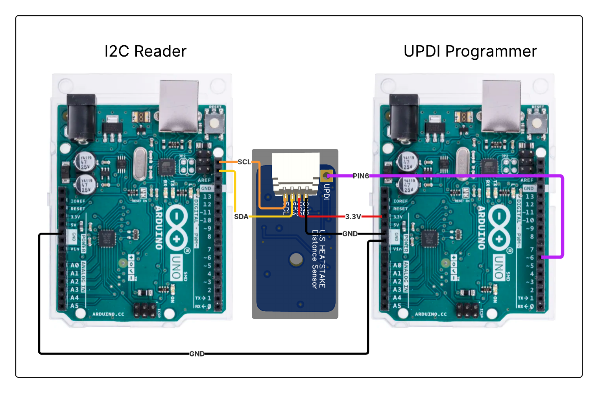

## Requirements

- Python 3.6 or higher
- PySerial library (pip install pyserial)
- megaTinyCore (https://github.com/SpenceKonde/megaTinyCore) 
- Arduino IDE 2.0 or higher

## Installation

1. Clone the repository:
   ```
   git clone https://github.com/taimurislamkhan/LE_Programmer.git
   cd LE_Programmer
   ```

2. Install Python dependencies:
   ```
   pip install pyserial
   ```
## Usage

To run the program with administrator privileges:

1. Simply double-click the `run_as_admin.bat` file
2. Grant administrator permissions when prompted
3. The program will execute with the required privileges


1. Run the main script:
   ```
   python arduino_manager.py
   ```

2. First-time setup:
   - Select option 1 (Setup) to configure your UPDI programmer and target Arduino
   - The program will scan for connected devices and guide you through the setup
   - This only needs to be done once unless you change your hardware setup

3. Calibrating a new device:
   - Select option 2 (Program)
   - Enter the device address (0-127)
   - The program will automatically:
     - Collect sine and cosine calibration values
     - Update the LE_Final sketch with these values
     - Compile and upload the calibrated firmware

4. Monitoring a device:
   - Select option 3 (Read) to monitor sine and cosine values from a running device
   - This is useful for troubleshooting or verifying calibration
   - Values are displayed and saved to a results file

## Hardware Setup



### UPDI Programmer Connection (Arduino 1)
1. Connect pin 6 of the Arduino UPDI programmer and the UPDI pin of the Linear Encoder
2. Connect GND of the Arduino to GND of the ATtiny1616
3. Connect the Arduino 1 to your computer via USB

### Linear Encoder Connection (Arduino 2)
1. Connect the SCL,SDA,3.3 and GND to Linear Encoder
2. Connect the Arduino 2 to your computer via USB

## Code Structure

The project has been modularized for better maintainability:

- **arduino_manager.py**: Main entry point with menu system
- **arduino_utils.py**: Utility functions for finding devices and basic operations
- **arduino_config.py**: Configuration management
- **arduino_upload.py**: Functions for uploading hex files
- **arduino_operations.py**: Core operations (Setup, Program, Read)
- **arduino_advanced.py**: Advanced operations (hidden menu options)
- **address_changer.py**: Handles updating address, sine, and cosine values in firmware

## Configuration

The program saves configuration in `arduino_config.json` to remember which Arduino is the UPDI programmer and which is the target Arduino. This avoids having to select the devices each time you run the program.

## Troubleshooting

### Common Issues

1. **No devices detected**
   - Ensure both the Arduino Uno and UPDI programmer are connected via USB
   - Check USB cables and try different USB ports

2. **Upload failures**
   - Verify the UPDI connections (pin 6 and UPDI pin)
   - Make sure the Linear Encoder is properly powered
   - Run the Check Dependencies option to verify avrdude is available
